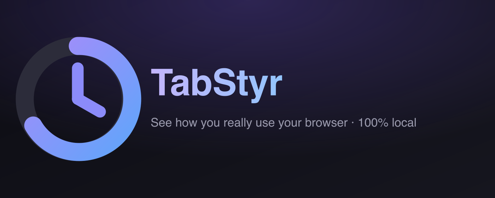
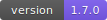
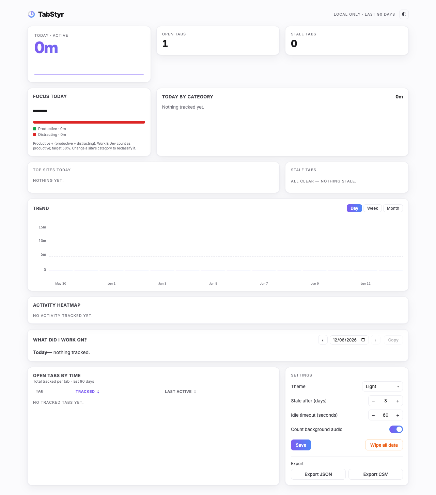
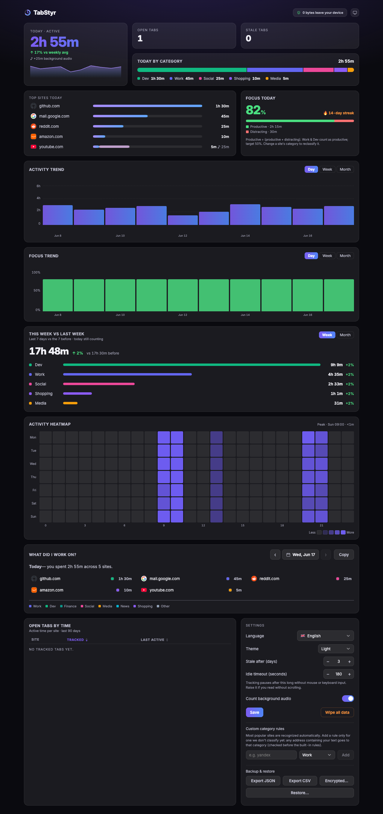
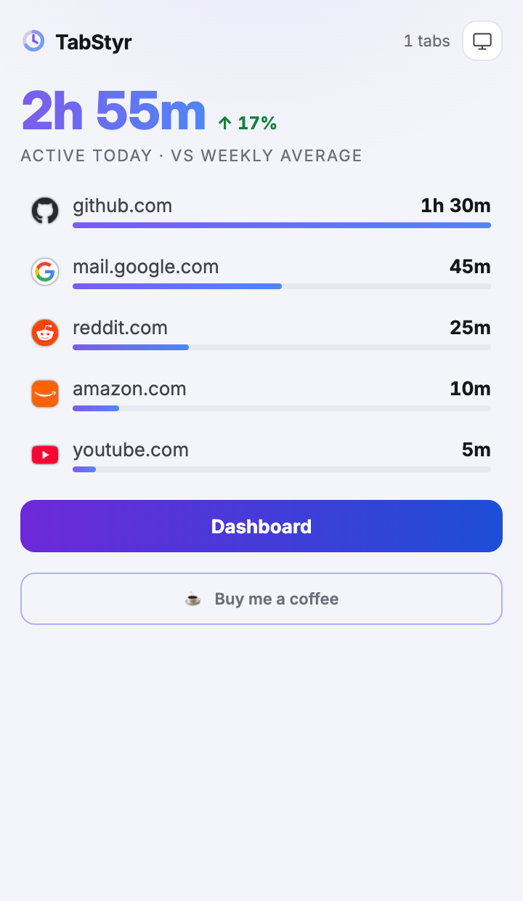
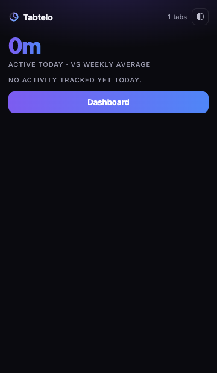

<div align="center">



# TabStyr

**See how you really use your browser — privately.**

Active time per tab and site, trends, an hourly heatmap, category & focus
breakdowns, and gentle stale-tab nudges. Every byte stays on your device.

[Features](#features) · [Privacy](#privacy) · [Browser support](#browser-support) ·
[Install](#install) · [How metrics work](#how-the-metrics-work) ·
[Scope & limitations](#scope--limitations) · [Development](#development) ·
[Changelog](CHANGELOG.md)

<br/>

[](https://github.com/latreon/tabstyr/actions/workflows/ci.yml)
[](LICENSE)


[](https://buy.polar.sh/polar_cl_RkZPHoSH8zAQndHySXwKoDhLRykeX8BuMANlE3FoBSo)

<br/>


</div>

---

## What is TabStyr?

TabStyr is a browser extension that quietly measures the time you spend on tabs
and websites, then turns it into clear, useful insights — a dashboard, trends, a
when-you-browse heatmap, work/distraction breakdowns, and reminders about tabs
you've forgotten.

It is **100% local**. There are no servers, no accounts, no analytics, and no
network requests. Your data lives in your browser's database and never leaves it.

> **The honest metric.** The headline number is your *active foreground time*.
> Background audio is counted and shown **separately**, so your totals never
> exceed the real time you spent at the computer.

---

## Features

### Tracking
- **Active-time tracking** per tab and per domain, second-by-second.
- **Idle-aware** — pauses when you step away (configurable timeout).
- **Manual pause** — a toolbar toggle, keyboard shortcut, or right-click menu
  item to stop tracking on demand, independent of idle detection.
- **Audio-aware** — background audio (music/video in another tab) is tracked and
  reported separately, never inflating your active total.
- **Restart-safe** — per-tab totals use a stable identifier, so they survive the
  browser reassigning tab IDs after a restart.
- **Excluded sites** — stop tracking specific domains entirely (no session, no
  entry anywhere), from Settings or the right-click menu.
- **Domain aliases** — fold fragmented subdomains or regional TLDs
  (`mail.google.com`, `amazon.co.uk`) into one canonical site across every view.
- **Keyboard shortcuts & right-click menu** — open the dashboard, toggle pause,
  or exclude the current site without opening the popup
  (rebindable at `chrome://extensions/shortcuts` or your browser's equivalent).

### Dashboard
- **Today** — active time with a sparkline and a vs-weekly-average delta.
- **Open / stale tab counts** — click either tile to open a tab manager (below).
- **Trend** — day, week, and month views.
- **This week vs last week** — period comparison (week or month) broken down by
  category, with per-category deltas.
- **Activity heatmap** — which hours of which days you browse most.
- **Today by category** — Work, Dev, Finance, Social, Media, News, Shopping, Other.
  **Click any site's category dot to re-classify it instantly** (a quick colored
  picker); the change applies everywhere.
- **Focus today** — a productive-vs-distracting ratio with a daily streak.
- **Top sites** with a per-domain detail view (its own trend, sessions, share,
  and heatmap).
- **Open tabs by time** — for each site you have open, its total active time over
  the last 90 days, sortable, with a per-site open-tab count.
- **Tab manager** — click the **Open tabs** or **Stale tabs** tile for a centered
  modal listing those tabs alphabetically, each with its favicon, domain, and
  last-active time. Jump to any tab, close one, or close them all — every close
  shows an **Undo** toast that reopens the tabs in their original window.
- **What did I work on?** — pick any day and copy a clean site list for standups
  or invoices.

### Popup
- Today's active total, top sites with favicons, and the stale-tab count. The
  stale count is a button that opens the dashboard's stale-tab manager directly.

### Data
- **Export** — full JSON backup, or CSV (daily totals or raw session log).
- **Scheduled backup** — optionally save a JSON backup to your downloads
  automatically (weekly / every 2 weeks / monthly). Off by default.
- **Encrypted backup** — optional passphrase-protected export (AES-256-GCM,
  PBKDF2-SHA-256), all in-browser via the Web Crypto API.
- **Restore / import** — load a JSON or encrypted backup on this or another device.
- **One-click wipe** of all stored data.
- **90-day rolling window** for raw sessions & daily totals, pruned automatically —
  with a compact per-domain **monthly roll-up** (no URLs) kept longer so long-range
  trends survive pruning.

### Look & feel
- System-aware **dark / light** themes with a manual toggle.
- **11 languages** — English, Español, Deutsch, Français, Italiano, Português (BR),
  Русский, Türkçe, 日本語, 한국어, 中文（简体）.
- Accessible, keyboard-friendly UI.

## Screenshots

| Dashboard (light) | Dashboard (dark) |
|---|---|
|  |  |

| Popup (light) | Popup (dark) |
|---|---|
|  |  |

> Captured from the live extension with sample data. Your own dashboard fills in
> as you browse.

**[Watch a 40-second demo](https://tabstyr.com/#how-it-works)** — a real screen
recording of the dashboard, not a slideshow.

## TabStyr vs. RescueTime / Toggl Track

Not a like-for-like replacement — TabStyr only sees browser tabs, not other
apps. If you need cross-app tracking, a system-level tool is the right choice.
For browser time specifically:

| | TabStyr | RescueTime | Toggl Track |
|---|---|---|---|
| Where your data lives | Only your device (IndexedDB) | RescueTime's servers | Toggl's servers |
| Account required | No | Yes | Yes |
| Price | Free, no tiers | Free tier + paid plans | Free tier + paid plans |
| Tracks | Browser tabs only | All apps + browser | Manual/automatic time entries |
| Source | Open (MIT) | Closed | Closed |
| Setup | Install, done | Install + account + sync | Install + account + workspace setup |

If cross-app tracking or team reporting is what you need, RescueTime or Toggl
are the better fit. If you specifically want to see where *browser* time goes
without an account or your data leaving the device, that's what TabStyr is for.

## Privacy

TabStyr collects **nothing** and sends **nothing**. All activity is stored locally
in your browser's IndexedDB. Raw sessions and daily totals are pruned to a 90-day
window; a compact per-domain monthly roll-up (no URLs, no timestamps) is retained
longer so long-range trends survive pruning — and it never leaves your device either.

- No servers, no cloud sync, no accounts.
- No analytics, no ads, no third-party code.
- It does **not** read page content — only the tab metadata (URL/title) the
  browser already provides to extensions.

Full policy: [docs/store/privacy-policy.md](docs/store/privacy-policy.md). The
policy is also viewable in-app — the **0 bytes leave your device** badge opens it
as an overlay (no new tab, no page navigation).

### Security

- **No network surface** — zero `fetch`/XHR, no remote scripts, no content
  scripts, no cross-origin messaging.
- **Strict CSP** on Chromium extension pages: `script-src 'self'`, `object-src
  'self'`, `connect-src 'none'`.
- **Hardened backup import** — every record is type-checked and capped; the
  passphrase KDF iteration count is clamped to a safe range to block downgrade and
  CPU-exhaustion from a crafted file.
- **Encrypted backups** use authenticated AES-256-GCM (a wrong passphrase or a
  tampered file fails to decrypt rather than returning garbage).

### Permissions

| Permission | Why it's needed |
|---|---|
| `tabs` | Know the active tab's URL/title to attribute time to the right site |
| `storage` | Save your stats and settings locally |
| `idle` | Pause tracking when you're away so totals stay accurate |
| `alarms` | Periodic checkpoints + the once-daily maintenance task |
| `notifications` | Optional, at-most-once-per-day stale-tab reminder |
| `webNavigation` | Detect in-page (SPA) route changes on the active tab so time is credited to the right page |
| `contextMenus` | Right-click menu: exclude the current site, pause/resume, open the dashboard |
| `downloads` | Optional scheduled backup export (off by default) — saves a JSON file locally, no upload |
| `favicon` (Chromium only) | Show site icons in lists |

No host permissions are requested — the extension cannot access page contents.

## Browser support

| Browser | Status |
|---|---|
| Chrome, Edge, Brave, Opera, Vivaldi, Arc (Chromium, MV3) | ✅ Fully supported — install as-is |
| Firefox 115+ (MV2 build) | ✅ Supported — favicons fall back to colored letter chips |
| Safari 16.4+ | ⚠️ Works after an Xcode conversion, with reduced features (see [Safari](#safari)) |

Same codebase, one build per engine; only packaging and a few platform APIs
differ. Full matrix and per-browser publish steps:
[docs/store/browser-support.md](docs/store/browser-support.md).

## Install

### From a store

- **Chrome, Edge, Brave, Opera, Vivaldi, Arc:** [Chrome Web Store](https://chromewebstore.google.com/detail/tabstyr/mgckngagefippkemgmmccfaaljmgllpa) — live
- **Firefox:** [AMO listing](https://addons.mozilla.org/en-US/firefox/addon/tabstyr/) — live
- **Edge Add-ons:** coming soon (Chromium build above works in Edge today via Developer mode)
- **Safari (Mac App Store):** not yet submitted — build and load it yourself via Xcode (see below)

### Unpacked (from source)

```bash
git clone https://github.com/latreon/tabstyr.git
cd tabstyr
npm install
node scripts/make-icons.mjs   # generate icons (once)
npm run build                 # Chromium → dist/chrome-mv3
npm run build:firefox         # Firefox  → dist/firefox-mv2
npm run build:safari          # Safari   → dist/safari-mv2
```

- **Chromium** (Chrome, Edge, Brave, Opera, Vivaldi, Arc): open `chrome://extensions`
  → enable **Developer mode** → **Load unpacked** → select `dist/chrome-mv3`.
- **Firefox:** open `about:debugging` → **This Firefox** → **Load Temporary
  Add-on** → pick any file inside `dist/firefox-mv2`.
- **Safari** (macOS + Xcode): wrap the build in an app, then enable it in Safari →
  Settings → Extensions:

  ```bash
  xcrun safari-web-extension-converter dist/safari-mv2 \
    --app-name "TabStyr" --bundle-identifier io.github.latreon.tabstyr --macos-only
  ```

  Full steps: [docs/store/browser-support.md](docs/store/browser-support.md).

## How the metrics work

What each number actually means:

- **Active time** = `total tracked − background audio`. This is foreground
  engagement and is the primary number everywhere. It excludes internal pages
  (`chrome://`, `newtab`, …), so the headline total always equals the sum of the
  sites you see listed.
- **Background audio** is shown separately (e.g. `♪ +30m`) — counted, never folded
  into the active total.
- **Focus %** = `productive ÷ (productive + distracting)`. Work and Dev count as
  productive; Social and Media as distracting; the rest are neutral and ignored.
  Re-categorize any site to change how it's counted. Target is 50%.
- **Streak** = consecutive days meeting the focus target.
- **Stale** = a tab you haven't focused for longer than your threshold (default 3
  days) and haven't snoozed.
- **Open tabs by time** = for each site you currently have open, its total active
  time over the 90-day window. Built from daily per-domain totals, so the number is
  stable across browser restarts (it doesn't depend on volatile tab IDs).
- **Sessions** are split every minute by a heartbeat and capped at 30 minutes, so a
  sleeping/suspended machine can't inflate your totals. (Media playback is exempt from
  the cap so a long video still reports its full watch time.)

## Scope & limitations

Deliberate design choices — listed so the behaviour reads as intended, not as a bug:

- **Bounded crash tail.** Time is checkpointed every minute and flushed on worker
  suspend. A hard browser crash can lose at most the seconds since the last
  heartbeat (≤ 1 minute) for the tab in focus; everything older is already saved.
- **Sleep / lock is capped, not exact.** When the OS sleeps or the screen locks,
  open non-media sessions are closed and capped at 30 minutes rather than booking
  the full away time. A multi-hour sleep never shows as multi-hour active time.
- **Very long uninterrupted reads can undercount.** Active time is checkpointed by
  a 1-minute alarm, but MV3 may suspend the service worker and throttle that alarm
  during long input-free reading. A single page read for hours with no interaction
  (and idle pausing disabled) can be capped at ~30 minutes for the un-checkpointed
  stretch. Any tab switch, scroll, or navigation checkpoints well within the
  window, so this only affects pathological cases.
- **Hard 24-hour ceiling per session.** Even uncapped media sessions are bounded at
  24 hours, so a system-clock jump (NTP correction, VM resume) can never book days
  of bogus time; a backward clock jump drops the affected slice rather than storing
  a negative duration.
- **Calendar-day tracking only.** Totals bucket by local calendar day; there is no
  "browser-session" reset mode. Closing every window does **not** erase history.
- **No content blocking.** TabStyr measures and reports; it does not block sites or
  enforce focus limits. The Focus % and streak are analytics, not a blocker. (No
  blocking permissions, content scripts, or network rules are requested.)
- **Local-dev hosts.** `localhost` and bare IPv4 addresses (e.g. `127.0.0.1`,
  `192.168.x.y`) are treated as real pages and grouped under **Dev**. IPv6 literals
  (`[::1]`) are not tracked.
- **Background audio on idle.** When you step away, background audio stops
  accruing (it isn't "away-from-keyboard listening time"); a focused, audible
  media tab keeps counting as watch time.
- **URLs are reduced.** Stored page identity is scheme + host + path (+ `#/` SPA
  route); query strings and token fragments are stripped, so secrets never land in
  storage or exports.

## Development

```bash
npm run dev                 # Chromium with hot reload
npm run dev -- -b firefox   # Firefox with hot reload
```

### Quality gates

```bash
npm run typecheck   # vue-tsc — zero type errors
npm test            # unit tests (Vitest)
npm run e2e         # Playwright end-to-end in Chromium (run `npm run build` first)
```

### Building for release

```bash
npm run build            # Chromium  → dist/chrome-mv3
npm run build:firefox    # Firefox   → dist/firefox-mv2
npm run build:safari     # Safari    → dist/safari-mv2 (then convert with Xcode)
npm run zip              # Chromium store-ready zip
npm run zip:firefox      # Firefox store-ready zip
node scripts/make-promo.mjs   # regenerate promo images
npm run promo:video           # regenerate the demo video (docs/store/promo/)
npm run changelog:fetch && npm run changelog:md   # refresh CHANGELOG.md after a release
```

## Testing

- **Unit** (Vitest) — every `lib/` module, including an end-to-end tracking-flow
  test that runs the real engine → key-stamp → DB → read pipeline.
- **End-to-end** (Playwright) — loads the built extension in Chromium and verifies
  the popup, dashboard tiles, export, theme toggle, live tracking, and tab focus;
  it also captures the screenshots used above.

```bash
npm run build && npm run e2e
```

## Support

TabStyr is free and open source. If it saves you time, a tip keeps it going:

<a href="https://buy.polar.sh/polar_cl_RkZPHoSH8zAQndHySXwKoDhLRykeX8BuMANlE3FoBSo">
  
</a>

Entirely optional — stars and bug reports help just as much.

## Contributing

Issues and pull requests are welcome — see [CONTRIBUTING.md](CONTRIBUTING.md)
for setup, quality gates, and PR guidelines.

## License

[MIT](LICENSE) © 2026 latreon
